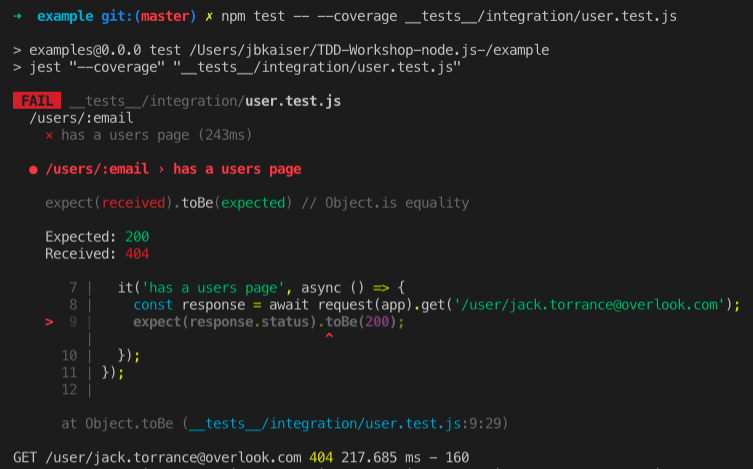

# Let's Do Some TDD

## Prereqs

- A mongo server running on localhost. If you don't have mongo installed locally, you can do it with HomeBrew. In the terminal:
```bash
brew tap mongodb/brew
brew install mongodb-community
mongod
```

## Feature

```
Scenario: User requests user profile  
Given the user record exists  
When I make a request to GET /users/:emailAddress  
Then the server responds with a 200 code  
  and the server returns the header "content-type: application/vnd.api+json"  
  and the server returns a user resource object  
  and the user object id is the email address  
  and the user object type is "user"  
  and the user object contains a data object  
  and data.attributes.firstName contains the user's first name  
```

Remember,  the 3 laws of TDD are: 

1. You are not allowed to write any production code unless it is to make a failing test pass.
2. You are not allowed to write any more of a unit test than is sufficient to fail.
3. You are not allowed to write any more production code than is sufficient to pass the one failing unit test.

Rule #1 says we can't write production code unless it's to pass a test, so the first thing we need to do is write a failing test.

### __tests__/integration/user.test.js [see it on github](https://github.com/grizzly-atoms/TDD-Workshop-node.js-/blob/0f7bf974d97e3c0c62ac8af7b837cea24fbf1787/example/__tests__/integration/user.test.js#L1-L11)
```javascript
'use strict';

const request = require('supertest');
const app = require('../../app');

describe('/users/:email', () => {
  it('returns user objects', async () => {
    const response = await request(app).get('/users/jack.torrance@overlook.com');
    expect(response.status).toBe(200);
  });
});
```

When we run this we see output similar to the following:



So we expected to see a 200 response from our application and instead got a 404. We could write more tests, but rule #2 says we must stop. Now we iterate back through our rules. We are now allowed to write production code because we have a failing test:

### app.js [see it on github](https://github.com/grizzly-atoms/TDD-Workshop-node.js-/blob/7afede1e826e062414e085559331e9aa066d1a36/example/app.js#L22-L23)
```javascript
...
app.use('/', indexRouter);
app.use('/users/?*', usersRouter); // update our route

...
```

### routes/users.js [see it on github](https://github.com/grizzly-atoms/TDD-Workshop-node.js-/blob/7afede1e826e062414e085559331e9aa066d1a36/example/routes/users.js#L9)
```javascript
var express = require('express');
var router = express.Router();

/* GET users listing. */
router.get('/', (req, res, next) => {
  res.send('respond with a resource');
});

router.get('/:email', (req, res, next) => {
  res.send();
}); // This is all we need

module.exports = router;
```

That satisfies the first requirement.  See if you can use TDD to satisfy the rest.

When you are done, your code should look like these:

[`__tests__/integration/user.test.js`](https://github.com/grizzly-atoms/TDD-Workshop-node.js-/blob/c56be3b2088c84154b98cf3012b58950558c03a8/example/__tests__/integration/user.test.js#L1-L23)

[`/routes/users.js`](https://github.com/grizzly-atoms/TDD-Workshop-node.js-/blob/c56be3b2088c84154b98cf3012b58950558c03a8/example/routes/users.js#L1-L21)

## Now things are getting interesting

Our API is meeting the basic requirements of the feature, but we've just mocked out a user object and we aren't actually getting anything from any kind of persisted storage. We need to make sure that we get user records from our database when we request them from the api. We'll start by adding another failing test, but things are going to get a little bit more complex now. We want to insure that our data is actually coming from the saved values in the database. That's going to require some extra setup. In the end, our test looks like this

```javascript
    response = await request(app).get('/users/wendy.torrance@overlook.com');
    expect(JSON.parse(response.text)).toEqual({
      id: 'wendy.torrance@overlook.com',
      type: 'user',
      data: {
        attributes: {
          firstName: 'Wendy',
        }
      },
    });
  ```

 To Get the full test and it's dependencies, you can run:

 ```bash
git checkout example-02.01
 ```

 Note, for this example you'll need a mongo server running on localhost.